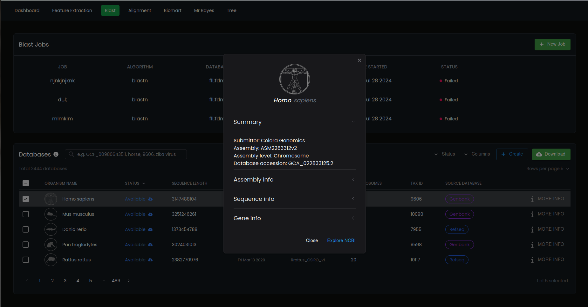

# Phylogeny lab 🧪🦎
[](https://discord.gg/ZmVn9Kzc9f)
[](https://github.com/Phylogeny-lab/Phylogeny-lab/pulse)

## TL;DR
An easy-to-use web application for comparative genomics with a great UI. It will include some of the main tools and external resources in the space such as NCBI BLAST+, Clustalw, Muscle, Biomart, Mr Bayes and more. When completed, we hope it will be useful for phylogeneticists and other evolutionary biologists as a research tool.

**Thanks for stopping by! To see current progress run in docker compose:**

```bash
docker-compose up --build
```

And visit http://localhost:3000 in your browser

> [!WARNING]  
> When downloading NCBI databases from NCBI's FTP site, sometimes database files fail to extract, or network issues occur. If this happens retry installing.

## Run Blast queries using NCBI databases 



## Run development stack

```bash
docker-compose -f docker-compose.dev.yml up --build
```

## Ethos & License
**We believe tools which aid in scientific research should be free and fully auditable by its community of users.** This makes it easier for those who are not part of an academic institution, or perhaps don't have the funds to purchase an expensive software license, to participate in active research. Open source software allows users to "scratch their own itch" by adding features they and others will find useful. Therefore, Phylogeny lab's codebase is 100% open source and packaged with the GNU GPL 3.0 license. This grants anyone the ability to modify or redistribute so long as the source code remains freely available. We plan to make this software available from an easily downloadable source in the future. 

## Roadmap

- [x] Blast portal
- [ ] Add support for more BLAST flavours
- [ ] Biomart page
- [ ] pairwise alignments page with blast
- [ ] Phylogenetic reconstruction page
- [ ] Cogent3 functionality, hmm models, substitution scores
- [ ] Dashboard
- [ ] Blast summaries
- [ ] Alignment summaries
- [ ] Alignment results page
- [ ] Learn D3 svg library
- [ ] Create custom cladogram components with D3
- [ ] Add tests and deploy with Github actions CI pipeline
- [ ] Add a documentation page (we already have a domain http://www.phylogenylab.io)

## Donate ❤️

All development on this project is unpaid. So if you're feeling generous and want to support the continuation of this project, consider donating!

Find us on [Patreon](https://patreon.com/GenomeLab?utm_medium=unknown&utm_source=join_link&utm_campaign=creatorshare_creator&utm_content=copyLink)


